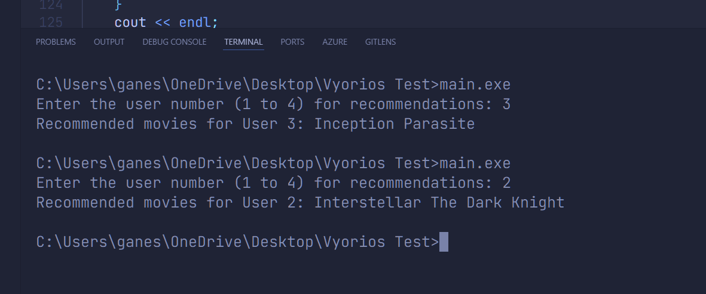

# Movie Recommendation System

This project is a collaborative filtering-based **movie recommendation system** implemented in C++. The system predicts ratings for unrated movies for a user and recommends the top N movies they might like.

---

## Features
- **Load ratings from a CSV file:** Users and movies are represented in a matrix format.
- **Calculate user similarity:** Uses cosine similarity to measure how closely users' preferences align.
- **Predict unrated movie ratings:** Generates weighted averages based on similar users' ratings.
- **Recommend movies:** Suggests the top N movies for a specific user.

---

## Input Data Format
The system uses a CSV file (`ratings.csv`) for user-movie ratings. The format is as follows:
- **Rows:** Represent users.
- **Columns:** Represent movies.
- **Values:** Ratings (1-5). A value of `0` means the movie is not rated by the user.

### Example of `ratings.csv`:
```
5 3 0 1 4
4 0 0 1 2
0 1 2 4 0
3 0 4 0 3
```


---

## Outputs



---

## How It Works
1. **Loading Data:** The program reads `ratings.csv` and constructs a user-movie ratings matrix.
2. **Calculating Similarity:** Compares the target user with others using cosine similarity.
3. **Predicting Ratings:** Predicts scores for unrated movies based on similar users' ratings.
4. **Recommending Movies:** Sorts movies by predicted ratings and suggests the top N unrated movies.

---

## Customization
- **Change the number of recommendations:** Modify the `topN` variable in the `main()` function.
- **Add more movies:** Update the `movieNames` vector and extend `ratings.csv` accordingly.

---

## Contributing
Feel free to contribute by submitting pull requests or reporting issues.

---

## License
This project is open-source and available under the MIT License.


